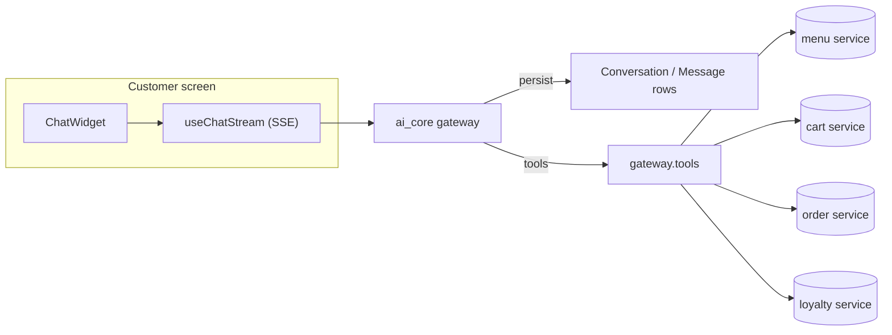
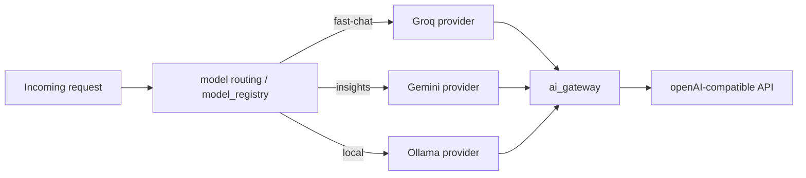

# AI Architecture — Zentro (domain: ai_core)

> Evidence: `backend/ai_core/*` (api, providers, gateway, routing/model_registry, services,
> use_cases, tools, prompts, tasks), `src/features/ai/*`, `src/lib/api/ai.ts`,
> `src/features/merchant-management/pages/MerchantStorePage` (AI waiter), `src/routes/merchant/store.tsx`

## The AI sandwich — customer ↔ AI waiter ↔ (menu/cart/order/loyalty services)

> The AI waiter is **assistant-scoped, not a direct DB writer**: it goes through the same
> domains (menu / cart / order / loyalty) that a human would. It never writes to
> `postgresql` directly — verify the read/write surface in health.md.

## Router → providers

## Building blocks

- `ai_core/providers/*` — provider adapters (Gemini, Groq, Ollama). `providers/registry`
  maps provider name → class.
- `ai_core/routing/model_registry.py` — model aliases (`fast-chat` → groq,
  `default_insights` → gemini; `AI_MODEL_ALIASES`— verify in settings).
- `ai_core/services/` — provider → service adapters, tool resolution, conversation/stream.
- `ai_core/use_cases/` — orchestration per product feature (e.g. `merchant_assistant.py`).
- `ai_core/tools/` — **read-only tools** the AI may call (menu, guidance, sales — verify).
- `ai_core/tasks/generate_report.py` — background merchant insights report (Celery).
- `ai_core/prompts/` — merchant assistant prompts; `daily_insights`/`missions` guidance.
- `src/features/ai/…` — merchant AI chat + customer AI waiter UI.

## What AI can do today (twist: read-only vs write)

| Capability | Tool/Use-case | Writes? |
|---|---|---|
| Merchant assistant (chat with merchant data) | `use_cases/merchant_assistant` + `tools/menu_tools` + `tools/guidance_tools` | **read-only** (until user asks to change something) |
| AI waiter (customer-facing ordering chat) | `ai_waiter_chat` / gateway tools | writes **orders/cart** via domain services only |
| Daily merchant insights report | `async generate_merchant_report` (Celery) | writes `AIRequest`/artifact rows |
| AI mission/rewards suggestions | `tools/sales_tools` (verify) | read-only |

> Providing the merchant assistant can *suggest* but not *commit* is a deliberate boundary:
> anything that mutates must go through the same POS/merchant/loyalty routes a human uses.
