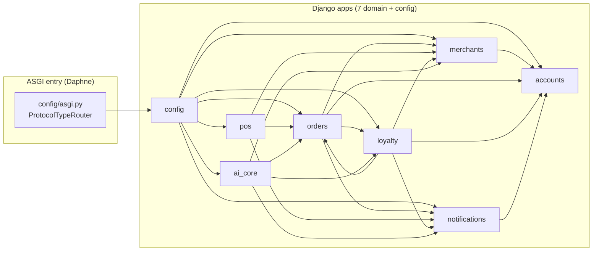
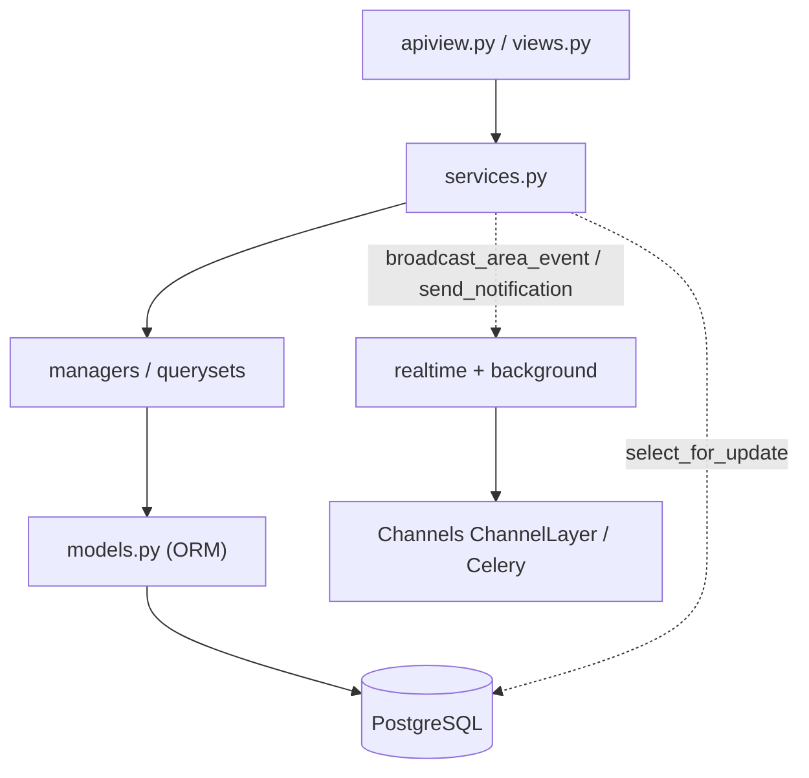

# Backend Architecture — Zentro (Django + DRF)

> Evidence-based. Apps under `backend/`. `AUTH_USER_MODEL = accounts.User`; DRF + SimpleJWT
> (access 1d DEV / 15m prod, refresh 30d, rotate+blacklist on). Django app graph below.

## API → Service → ORM layering

Every app keeps a strict 3-layer structure and **no view calls ORM directly for writes**
(views delegate to `services.py`):

- **Cross-app coupling evidence** (verified imports):
  - `pos/views.py` imports `orders.views._award_loyalty`, `_deduct_reward_redemption_points`,
    `orders.services` and `loyalty.services`; `orders/services/preparation.py` calls
    `pos.views` KOT generation; `orders/views.py` calls `loyalty.services` + `notifications.services`.
  - `_award_loyalty` lives in `orders/views.py` but is invoked from `pos` payment flow —
    loyalty awarding is **triggered from orders confirmation**, but loyalty models live in `loyalty`.

## Service layer references (shared across apps)

| Service file | Owned by | Consumed by |
|---|---|---|
| `loyalty/services.py` (wallet, punch, reward, points) | loyalty | orders, pos, orders.views |
| `orders/services/preparation.py` | orders | pos, orders.views |
| `orders/views.py` `_award_loyalty` / `_deduct_reward_redemption_points` | orders | pos |
| `notifications/services.py` (`send_notification`) | notifications | orders, merchants, loyalty, pos, ai_core |
| `merchants/services.py` (theme, presets) | merchants | index, index.tsx hero, MerchantThemeProvider |
| `merchants/views.py` `upload_image` etc. | merchants | media upload |
| `ai_core` services + tasks | ai_core | all apps (via celery + views) |

## Domain boundary table

| App | Model(s) it owns (primary/Owned exclusively) | Cross-app FK (it points OUT) |
|---|---|---|
| accounts | User, CustomerProfile, MerchantProfile? — see note | — (base) |
| merchants | MerchantProfile, MenuItem, MerchantTable, MenuCategory/OptionGroup | MenuItem.prep_area → orders.PreparationArea; user.FK → accounts |
| orders | Order, OrderItem(+Option), PreparationArea | order.customer → accounts; order.merchant → merchants; punch card purchases → loyalty |
| loyalty | CustomerMerchantWallet, PunchCard, PunchCardReward, Rewards, Missions, PointsTxn, Transfers | card.merchant/customer → merchants/accounts |
| pos | PosDevice, ShiftWorker, StaffShift, CashShift, POS Payments, StaffPreparationArea | → orders, merchants, accounts |
| notifications | Notification, PushSubscription | user FK → accounts |
| ai_core | AIRequest/Conversation/Message + provider connector models | merchant/customer → merchants/accounts |

> `MerchantProfile` lives in `merchants`.

## Cross-cutting concerns

- **Idempotency**: POS order creation uses `ProcessedClientMutation` keyed on
  `client_mutation_id`; punch/reward redemption proofs are idempotency-guarded.
- **Concurrency**: `select_for_update` on merchant/order/wallet rows in POS payment split
  + refund (`pos/views.py` `create_payment`, `pos.views` `pos/refund`), loyalty wallet
  mutations, punch-card redemption.
- **Throttling** (DRF): POS auth `1200/hour`, PIN `20/min`, transfer `10/hour`, redeem
  `10/min`, guest `60/hour`, upload `100/hour`, leaderboard `300/hour`.

## Wheel of cross-app import risk

`pos` import graph has the widest fan-out: `pos → {orders, merchants, accounts,
notifications, loyalty, catalog}` — and `orders` has the most incoming realtime/cross-app
edges. `orders` acts as a hub (see health.md — HIGH dedicated section).
