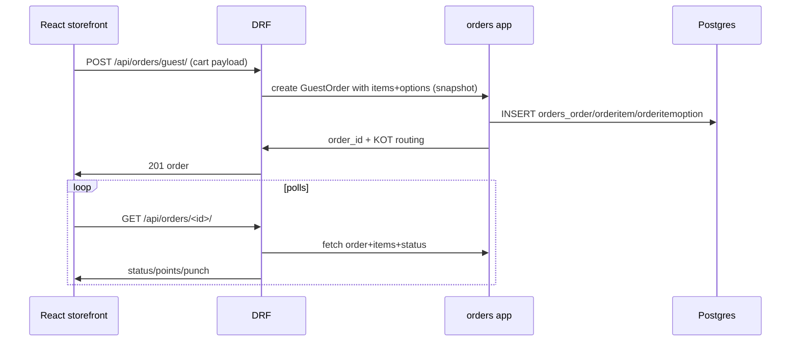

# Database / Domain Map — Zentro (PostgreSQL)

> SQLite default dev, Postgres in Docker/prod (`backend/config/settings.py` DATABASES).
> Zentro_globe uses `db.sqlite3` unless `DATABASE_URL` is set — verify production uses Postgres.

## Domain → table ownership map

```mermaid
erDiagram
    USER ||--o| CUSTOMER_PROFILE : "accounts"
    USER ||--o| MERCHANT_PROFILE : "merchants (user scoped)"
    MERCHANT_PROFILE ||--o{ MENU_ITEM : "has"
    MERCHANT_PROFILE ||--o{ MENU_ITEM_OPTION : "has"
    MERCHANT_PROFILE ||--o{ TABLE : "tables"
    MERCHANT_PROFILE ||--o{ MERCHANT_CARD_PREVIEW : "card design"

    CUSTOMER_PROFILE ||--o{ ORDER : "places"
    MERCHANT_PROFILE ||--o{ ORDER : "receives"
    ORDER ||--|{ ORDER_ITEM : "contains"
    ORDER_ITEM ||--|{ ORDER_ITEM_OPTION : "has"

    ORDER ||--o| PUNCH_CARD_REDEMPTION : "redeems"
    ORDER ||--o| PAYMENT : "paid by"

    CUSTOMER_PROFILE ||--o{ CUSTOMER_MERCHANT_WALLET : "holds"
    MERCHANT_PROFILE ||--o{ CUSTOMER_MERCHANT_WALLET : "issued"
    CUSTOMER_MERCHANT_WALLET ||--o{ PUNCH_CARD : "has"
    CUSTOMER_MERCHANT_WALLET ||--o{ MISSION_PROGRESS : "tracks"
    CUSTOMER_MERCHANT_WALLET ||--o{ REWARD_REDEMPTION : "spends"
    CUSTOMER_MERCHANT_WALLET ||--o{ POINTS_TRANSACTION : "accrues"

    MERCHANT_PROFILE ||--o{ LOYALTY_RULE : "config"
    MERCHANT_PROFILE ||--o{ MISSION : "creates"
    MERCHANT_PROFILE ||--o{ REWARD : "offers"
    MERCHANT_PROFILE ||--o{ PUNCH_CARD_TEMPLATE? : "config"
    MERCHANT_PROFILE ||--o{ TODAY_SPECIAL : "sets"

    MERCHANT_PROFILE ||--o{ PREPARATION_AREA : "labal"
    ORDER_ITEM ||--o{ PREPARATION_AREA : "routed"

    MERCHANT_PROFILE ||--o{ SHIFT_WORKER : "employs"
    SHIFT_WORKER ||--o{ STAFF_SHIFT : "owns"
    POS_DEVICE ||--o{ POS_PAYMENT : "records"
    SHIFT_WORKER ||--o{ CASH_SHIFT : "balances"
```

> ⚠ `PUNCH_CARD_TEMPLATE?` — punch card is modelled either as generic `PunchCard` hanging off
> `CustomerMerchantWallet` (punch-cards feature), not a separate merchant template. Verify
> before trusting this node — see `features/punch-cards` + `loyalty-engine` models.

## Vertices (verified tables + key columns)

| Table | Domain | Key relationships |
|---|---|---|
| `accounts_user` | Accounts | base for customer+merchant |
| `accounts_customerprofile` | Accounts | 1:1 to User |
| `accounts_merchantprofile` | Merchants | 1:1 User? — verify (see below) |
| `merchants_menuitem` | Menu | FK merchant; prep_area; optional_category; today_special |
| `merchants_menuitemoption` | Menu | FK menu_item |
| `merchants_merchanttable` | Tables | FK merchant; public_token; qr |
| `orders_order` | Orders | FK customer, merchant, membership?, table?, preparation_area |
| `orders_orderitem` | Orders | items |
| `orders_orderitemoption` | Orders | option snapshots |
| `orders_preparationarea` | Preparation/KDS | area groups merchant items |
| `loyalty_customermerchantwallet` | Loyalty | FK customer+merchant (join table) |
| `loyalty_punchcard` | Loyalty | FK wallet; counts; reward threshold |
| `loyalty_missionprogress` / `mission` | Loyalty | progress on wallet |
| `loyalty_reward` / `rewardredemption` | Loyalty | redemptions with codes |
| `loyalty_pointstransaction` | Loyalty | ledger |
| `loyalty_transfer` | Loyalty | transfers between wallets |
| `pos_posdevice` | POS | FK merchant |
| `pos_shiftworker` / `pos_staffshift` / `pos_cashshift` | POS/Schedule | shift + cash tracking |
| `pos_pospayment` | Payments | session-scoped (POS) |
| `orders_order.payment*` | Payments | customer payments (online/table) |
| `notifications_notification` + `pushsubscription` | Notifications | user-scoped |
| `ai_core_*` | AI | conversations/messages/artifacts |

> Cross-check `accounts.merchantprofile` vs `merchants.merchantprofile`: both names exist —
> one is on `accounts` for global identity, the other is the merchant-owned store profile.
> The docs previously said `MerchantProfile` is in `merchants`. **Verify with the models files
> before drawing hard conclusions.**

## How orders read/write via domain tables (end-to-end example — table ordering)



## Realtime / KDS (preparation) realtime tables

The KDS area model `PreparationArea` is owned by `orders` (preparation) but tempo-closely
coupled with `merchants.MenuItem.prep_area` + `pos`. See `realtime.md`.
