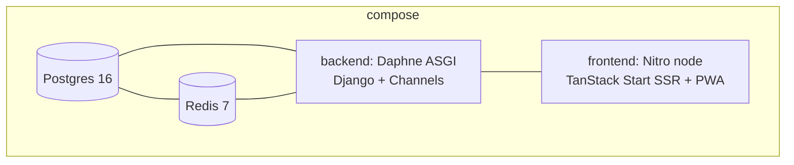

# Deployment & Infrastructure — Zentro

> Evidence: `docker-compose.yml`, `Dockerfile.backend`, `Dockerfile.frontend`, `backend/config/settings.py`,
> `backend/config/asgi.py`, `backend/config/celery.py`, `scripts/*.sh`, `.github/workflows/ci.yml`.

## Service boundary (compose)



Key facts (verified, `docker-compose.yml` + Dockerfiles):

- **Backend** runs under **Daphne (ASGI)** — serves both HTTP (`get_asgi_application`) and
  WebSockets (`ProtocolTypeRouter`). Entrypoint: `daphne -b 0.0.0.0 -p 8000 config.asgi:application`.
- **PostgreSQL**: service `db` (postgres:16-alpine), named volume `postgres_data`, healthcheck
  `pg_isready -U postgres -d zentro`. `DATABASE_URL=postgresql://postgres:postgres@db:5432/zentro`.
- **Redis**: service `redis` (redis:7-alpine), `REDIS_URL=redis://redis:6379/0`. Used for
  ChannelLayer + Celery broker/result.
- **Celery → NOT currently daemonized in compose** — no `worker`/`beat` service. The compose
  file starts backend (HTTP/WS) + frontend + db + redis only. See `background.md`.

## Storage / media

- `MEDIA_ROOT` + `useS3` toggle; `DEFAULT_FILE_STORAGE` s3 when `USE_S3_STORAGE=true`.
- Media served via Django view (`serve_media`) with strict content-type + hardening headers
  (verified `config/views.py`), PathTraversal guard.

## Env → boot map (settings, single-file)

```
backend/.env (load_dotenv at import)
  ├─ SECRET_KEY        (prod: REQUIRED — hard error)
  ├─ DEBUG / ALLOWED_HOSTS
  ├─ DATABASE_URL      (else SQLite)
  ├─ REDIS_URL         (else in-memory channel + eager celery)
  ├─ USE_S3_STORAGE / AWS_* (optional)
  ├─ CORS_ALLOWED_ORIGINS / CSRF_TRUSTED_ORIGINS
  ├─ FRONTEND_URL
  └─ GEMINI/GROQ/OLLAMA keys, VAPID keys (optional AI/push)
```

## CI (verified `.github/workflows/ci.yml`)

- Backend job: migrations-consistency check (`makemigrations --check --dry-run`) + full test
  suite against Postgres test database.
- Frontend job: `tsc --noEmit`, `vite build`, `eslint` (lint informational).
- ❌ No separate lint step for Python, no coverage gate, no CD/deploy job yet.

## Deployment status (see `deployment` doc + production-readiness scorecard)

Railway-deployed (`RAILWAY_PUBLIC_DOMAIN` is auto-added to `ALLOWED_HOSTS`/CSRF when set).
Static via Whitenoise. Web push optional (VAPID). S3 optional.
