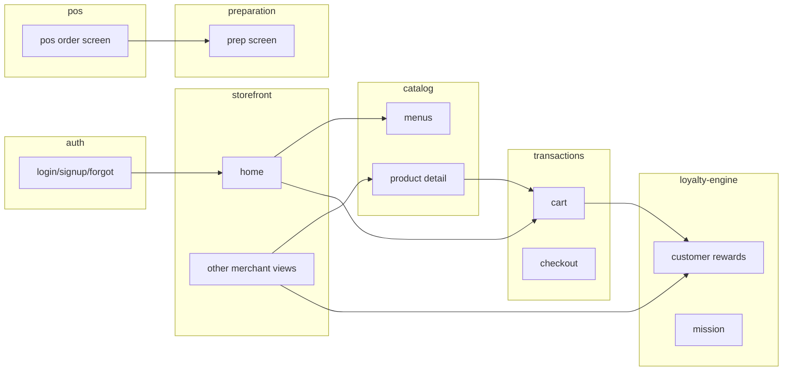

# Frontend Architecture — Zentro (TanStack Start)

> Map of the React/TypeScript frontend: route→feature→component→API. Verification basis:
> `src/routes/`, `src/features/`, `src/components/`, `src/lib/api/`. All measured from imports.

## Route table (verified endpoints; full at `src/routes/*`)

| Route | Page (feature) | Public? |
|---|---|---|
| `/` | Storefront Home (customer) | Auth optional |
| `/auth/login` `/auth/signup` | Auth (auth) | public |
| `/m/:slug` | Merchant storefront | public |
| `/m/:slug/table/:token` | Table QR ordering | public (guarded) |
| `/m/:slug/menu`, `/m/:slug/order` | Menu / checkout | public |
| `/m/:slug/pdf-menu/:token` | QR PDF menu | public |
| `/customer/orders` | Customer order history | Auth |
| `/cards`, `/cards/:merchantSlug` | Membership cards | Auth |
| `/rewards` `/leaderboard` | Rewards / leaderboard | Auth |
| `/merchant/*` (orders, prep, pos…) | Merchant dashboards | MerchantAuth |
| `/pos`, `/pos/preparation*`, `/pos/orders` | POS + KDS | Bouncer/POSAuth |
| `/table/:token/order` | Table order screen | public |

> Route→API mapping is centralized in `src/lib/api/*` — **the frontend never talks to Django
> directly; it is a thin wrapper over `.delay()` of the endpoints in `src/lib/api` (plus PWA +
> Supabase legacy stubs).**

## Feature module graph (verified imports)



## Typical API-consumption pattern

```mermaid
flowchart LR
    SC[Screen component] --> HOOK[useQuery / useMutation]
    HOOK --> API[src/lib/api/<module>.ts]
    API --> FETCH[django-api-base → fetch with JWT]
    FETCH --> DRF[Django endpoints]
    SC --> STORE[zustand store (cart / pos)]
```

## Shared UI layer

`src/components/ui/*` = Radix-based primitives (button, dialog, sheet, card, input…).
`src/components/*` = cross-feature building blocks (MobileShell, LoyaltyCard, HomeFeatureGrid,
PremiumPunchCard, TodaySpecial…). `src/components/brand/*` = brand assets/logos.

## Cross-feature coupling (evidence)

- `features/transactions` imports `features/catalog` (ProductDetailSheet) + `features/pos`
  (printing KOT) → see `health.md` for the POS-ordination coupling flag.
- `features/loyalty-engine` imports `features/merchant-management` (TodaySpecialPopup)
  + `features/missions` + `features/rewards` + `features/punch-cards` — a hub pattern.
- `features/customer-management` imports `features/pwa` (PwaProvider) → read `health.md`.
