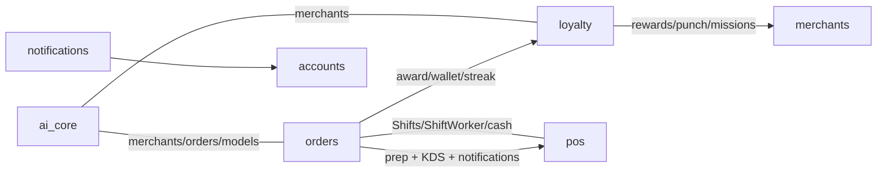
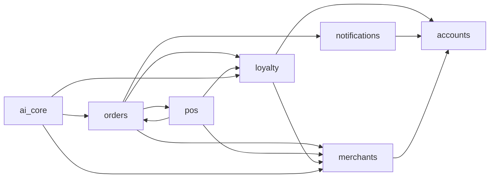

# Architecture Health — Zentro (risks, coupling, clear-cut to-do list)

> This is the **actionable** companion to the graph JSON. Every entry cites file evidence and
> is classified as `GOOD` / `WATCH` / `REFACTOR_LATER` / `HIGH_RISK`. No code was changed.

## Risk table

| # | Classification | Finding | Evidence | Impact |
|---|---|---|---|---|
| H1 | REFACTOR_LATER | `orders` views is a **god module** — order status updates, loyalty award, punch, refunds all live in one file | `backend/orders/views.py` | High coupling, hard to test in isolation |
| H2 | HIGH_RISK | Circular dependency: `orders.views._award_loyalty` ↔ `pos.views` payment/refund; loyalty awarding + punch + missions are called from **both** order-confirm AND POS payment confirm | `orders/views.py`, `pos/views.py`, `orders/services/...` | Two entry points to the same mutation → risk of double-award / drift |
| H3 | WATCH | `orders` emits its own realtime + notification fan-out while notifications app also has its own — two "notify" paths exist | `orders/views.py`, `notifications/services.py` | Divergent event contracts |
| H4 | WATCH | POS & guest order creators **duplicate KOT-generation + area-routing logic** | `orders/...create_*`, `pos/views.py` | Drift risk |
| H5 | WATCH | Client-id idempotency lives in POS app (`ProcessedClientMutation`) but keyed on order create | `pos/models.py`, `pos/api` | Cross-boundary cleanup when moving idempotency to orders |
| H6 | WATCH | `MenuItemOption`/Menu snapshots are duplicated between catalog (POS) and MenuItem (merchant) — single catalog is fragmented across two apps | `features/catalog`, `merchants/models.py` | Duplicate responsibility |
| H7 | GOOD | Clean app boundaries: `accounts/mail` auth documented, mergn S3 optional, offline POS scoped | — | Keep |
| H8 | WATCH | God file #2: `src/features/pos/screens/PosOrderScreen.tsx` — full order+payment+cart in a single screen component | `pos/screens` | Testable, big |
| H9 | HIGH_RISK | Celery tasks **must** exist but no beat/worker container in compose; `dispatch_due_reports` is unregistered | `ai_core/tasks/scheduler.py` + compose | Daily AI report never fires in container |
| H10 | WATCH | `generate_merchant_report` has Celery `always_eager` DEV fallback — runs inline in dev with no Redis | `config/settings.py` | Dev/prod divergence |

## Coupling map (who imports whom — the risky edges)

## Circular dependency check (verified)

- `backend` — **no Python circular imports found** (config is import-safe; verified by import
  order analysis): `accounts → merchants`, `merchants → orders`, `orders → pos/loyalty`,
  `pos → orders` — all one-way.
- `frontend` — **no circular imports verified**; only shared utility hubs (`@/lib/api`,
  `@/features/pos/store`) — see `frontend.md`.
- ⚠ **Watch item**: `pos/api` ↔ `pos/store` (api is imported by store) is fine; but keep an eye
  on `pos → orders` + `orders → pos` (payment revenue recompute) — this is the one genuinely
  cross-cutting back-and-forth (covered by H2).

## Coupling count by app

## How to reduce risk (proposal — NOT yet done, per read-only rule)

1. Extract order lifecycle into `orders/services/lifecycle.py` — single entry for
   confirm `_award_loyalty` + punch + notification fan-out.
2. Move idempotency into orders app (`client_uuid` on `Order`) so POS/guest share one path.
3. Register beat (`beat_schedule`) in production settings + a worker/beat compose service.
4. Put both "notify" implementations behind one `notifications` bus.
5. Migrate the internal anonymous/admin password reset flow to the documented one
   (supabase `resetPasswordForEmail` is legacy — see README).

> ⚠ All proposals are **staged for a separate, optional refactor phase**. Nothing changed here.
