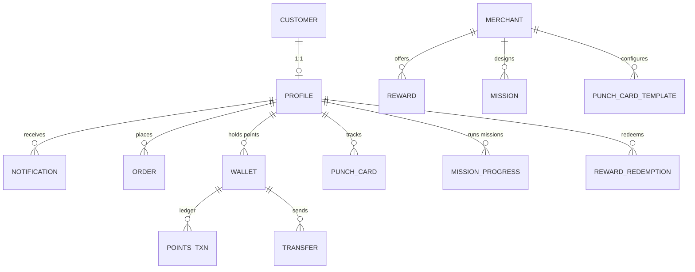

# Loyalty Engine — Zentro (domain: loyalty)

> Evidence: `backend/loyalty/*` (models/services/views/tests), `src/features/loyalty*`,
> `src/features/missions`, `src/features/rewards`, `src/features/punch-cards`,
> `src/features/customer-membership`, `src/lib/api/loyalty.ts` + `loyalty-engine`.

## Domain model (verified)



Key models in `loyalty/models.py` (exhaustive, evidence): `LoyaltyRule`, `CustomerMerchantWallet`,
`PunchCard` (+ `PunchCardTemplate`), `PunchCardRedemption`, `Reward`, `RewardRedemption`,
`Mission` (+ progress), `PointsTransaction`, `Transfer`, `PointsAutoTopUps?` — **verify each
name against the file before referencing**.

## Loyalty rule resolution

```
confirm(order)
  → resolve LoyaltyRule by (merchant, customer-wallet, rule-enabled)
  → compute points (points_per_currency / punch rules)
  → write PointsTransaction + sync CustomerMerchantWallet.balance
  → update streak / mission progress
  → optionally create punch card
```

## Missions & streaks

- `Missions` are merchant-defined (e.g. "5 orders in a week").
- `Missions` progress is stored **per (merchant, customer-wallet)** via `MissionProgress`
  — a customer on one merchant has independent progress across merchants.
- Streak logic lives in `loyalty/services.py` (`update_streak`) and is guarded by
  per-wallet/last-order-date to avoid punch-card re-award on cancel.

## Redemption of reward vs punch card

Two distinct flows — kept separate in `health.md`:

1. **Reward redemption** — merchant-defined `Reward` with points price; crew deducts points,
   creates a `RewardRedemption` + one-time redemption code; customer shows code at POS.
2. **Punch card** — free-item after N punches; `PunchCardRedemption` records when the card
   is full and the first redemption consumes it.

> Loyalty is **write-mode** (not read-only) and couples to both `orders` (order award)
> and `pos` (POS punch confirms). The read side (leaderboard/missions/rewards) is
> customer-scoped `loyalty` reading orders + merchant data — see `database.md`.
