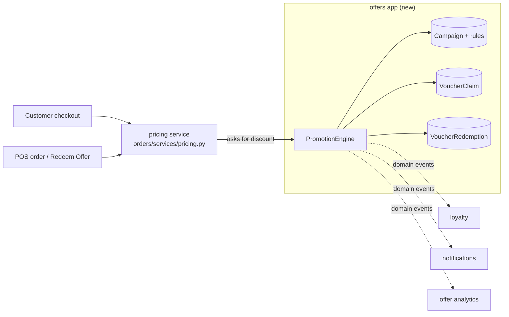
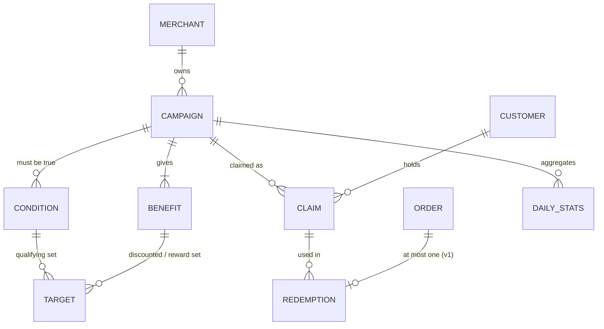
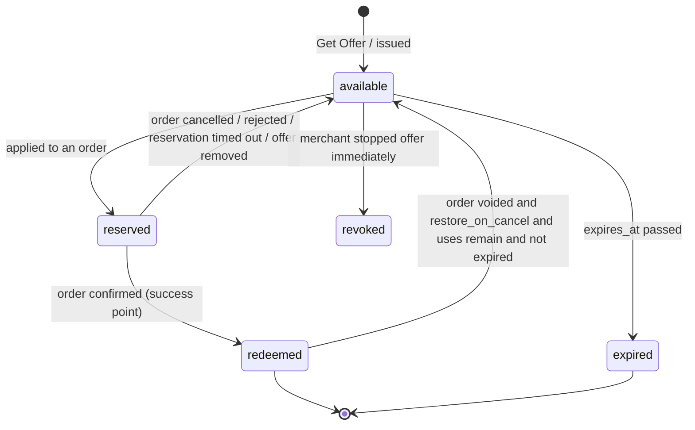

# Zentro Offers — Architecture (domain: offers)

> Status: **implemented (v1)** — backend app `backend/offers/`, frontend
> `src/features/offers/` + POS `src/features/pos/offers.ts`. See **§16** for what was
> built and where it deliberately differs from the design below. This document
> refines the original "Zentro Offers" product brief against how Zentro works.
> Evidence for the "today" statements: `orders/models.py` (`Order.discount_*`,
> `reward_redemption`, `punch_card_redemption`), `orders/views.py` (tax recompute on
> item add), `pos/views.py` (`PosDiscount` apply, offline mutations), `config/tax_utils.py`,
> `loyalty/models.py` (`Redemption`, `MembershipQrToken`), `merchants/models.py`
> (`business_type`, `latitude/longitude`, `timezone`, `currency_code`),
> `docs/architecture/payments.md`, `pos-kds.md`, `health.md` (#ORD-LOY).

## 1. Verdict on the original brief

The brief gets the fundamentals right, and they stay:

- **Campaign / Claim / Redemption are separate.** "Get Offer" never consumes anything.
- **One central `PromotionEngine`**, used by both online checkout and the POS.
- **The server is authoritative**: all eligibility and money come from database values,
  calculated with `Decimal`.
- **One promotion per order** in v1.
- **Structured rules** (conditions, benefits, targets) rather than free text.
- **Opaque, non-guessable codes**, merchant scoping, rate limits, row locking and
  idempotency.

What it misses is mostly about **how Zentro already works**. Those gaps would cause real
bugs if the brief were built as written:

| # | Gap in the brief | Why it matters in Zentro | Fix (section) |
|---|---|---|---|
| 1 | No single place that computes an order's total | The final total formula was re-implemented in about six places in `orders/views.py` and `pos/views.py` (line pricing and the tax function were already shared). Tax was taken on the **pre-discount** subtotal, and discounts were frozen amounts. **Now fixed:** see `pricing.md`. | §3 Pricing pipeline |
| 2 | "Redeemed after successful payment" | Zentro has **no payment gateway**. Payments are internal POS records. The success point has to be defined in Zentro's own order lifecycle. | §5 Lifecycle |
| 3 | Cancellations and refunds after redemption | An order can be cancelled after it's confirmed. The brief never says whether the voucher comes back. | §5 Lifecycle |
| 4 | Order changes after a promotion is applied | Items can be added to an open dine-in order, and bills can be split. Minimum spend or qualifying items can stop being true. | §5.3 Re-evaluation |
| 5 | Existing discounts | Zentro already has Today's Special item discounts, POS manual discounts (`PosDiscount`), loyalty reward redemptions and punch-card redemptions on `Order`. "One promotion per order" has to say how these combine. | §6 Stacking policy |
| 6 | Offline POS | The POS works offline (IndexedDB queue). A voucher redeemed offline can't be checked for double use. | §8.4 Offline |
| 7 | Guests | Table-QR orders can be placed by guests with no account, but a claim belongs to a customer. | §8.5 Guests |
| 8 | Campaign edits after launch | If a merchant edits "20% off" to "10% off" after customers claimed it, what do claims and history show? | §4.2 Versioning |
| 9 | "Eligible branch" | Zentro has **no branch model**. One `MerchantProfile` is one location (inventory reserves a `branch` FK "for future multi-branch"). | §9 Location |
| 10 | Merchant category | `business_type` is free text today. | §9 Taxonomy |
| 11 | Where the order discount lands on each line | Partial refunds, split bills, per-line tax and item analytics all need to know how much discount each line got. | §3.2 Allocation |
| 12 | View analytics at scale | Storing one row per offer view gets expensive. | §10 Analytics |
| 13 | Future targeted offers (birthday, win-back) | These need offers **pushed** to a customer without them tapping "Get Offer". | §11 Retention |

## 2. Domain boundaries



- **New Django app `offers`**. It owns campaigns, claims, redemptions and the engine.
  It must not import `orders.views` or `pos.views`.
- **The engine never writes order totals itself.** It returns a *priced result*, and the
  pricing service (§3) applies it. That keeps "what is the total" in exactly one place.
- **Offers and Loyalty talk through events, not direct calls.** After a redemption the
  engine emits `promotion_redeemed` (a Django signal, sent on commit). Loyalty and
  notifications react to it. This avoids repeating the orders→loyalty control-flow
  inversion flagged in `health.md` (#ORD-LOY).

## 3. Pricing pipeline (prerequisite, build first)

> **Implemented as pricing v1** — see [`pricing.md`](pricing.md). Offers plug in by passing an
> `AdjustmentSpec` (kind `promotion`) to `orders.pricing.attach_adjustment`; the engine already
> supports min-spend, eligible lines, max amount, re-validation and line allocation.

### 3.1 One function for every total

Add `orders/services/pricing.py` with a single entry point, used by guest/table orders,
customer orders, POS orders, add-items, split bills and the POS discount endpoint:

```
price_order(order, *, promotion=None) -> PricedOrder
  1. line_subtotal    = Σ (unit_price_after_item_discount + option deltas) × qty
                        (Today's Special / item discount already baked into unit price)
  2. order_discount   = EITHER promotion discount (via PromotionEngine)
                        OR POS manual discount OR loyalty reward   (never two; §6)
  3. allocate order_discount across lines          (§3.2)
  4. taxable_base     = line_subtotal − order_discount
  5. tax              = calculate_tax(taxable_base, merchant)      (per tax_components)
  6. service_charge   = computed on taxable_base (if the merchant uses one)
  7. total            = taxable_base + tax + service_charge
  All amounts are Decimal, quantized to the merchant currency's minor unit with
  ROUND_HALF_UP, and quantized only at the line and total boundaries.
```

**Decision needed from the business:** tax on the discounted amount (step 4) is the
normal rule for VAT-style taxes, including Nepal VAT, where a discount given at the time
of sale reduces the taxable value. Today's code taxes the pre-discount subtotal. Confirm
with the accountant which rule applies before shipping. The pipeline supports either one
with a single flag.

Refactoring the existing call sites onto `price_order` is **Phase 0**. It fixes today's
inconsistent POS discount tax handling as a side effect.

### 3.2 Discount allocation to lines

An order-level discount is split across the eligible lines in proportion to their
value, using largest-remainder rounding so the parts sum exactly to the total. It's
stored on the line:

- `OrderItem.promotion_discount` (Decimal, default 0)
- `OrderItem.is_promotion_reward` (bool)
- `OrderItem.promotion_redemption` (FK, nullable)

This makes partial refunds, split bills, per-line tax, receipts and "sales per item"
analytics correct without recalculating anything.

## 4. Data model



### 4.1 Models

**`PromotionCampaign`**: the offer and its rules.
- `merchant` (FK), `title`, `description`, `terms` (plain text shown to customers),
  `image_url`
- `status`: `draft → scheduled → active → paused → ended → archived`
  (computed from dates, plus merchant actions)
- `visibility`: `public` (shown on the marketplace) · `link_only` (private link or QR
  poster) · `targeted` (only issued by automation or the merchant; §11)
- `channels`: `online`, `pos` or both
- `starts_at`, `ends_at`, evaluated in `merchant.timezone`. Optional `active_hours`
  (days of week plus time windows, for "happy hour").
- `claim_valid_days`: how long a claim stays usable after claiming (for example 14
  days), capped at `ends_at`
- Limits (see §7): `max_claims`, `max_redemptions`, `per_customer_limit`,
  `min_order_amount`, `max_discount_amount`
- `exclude_discounted_items` (bool, default true): whether items already reduced by a
  Today's Special count
- `restore_on_cancel` (bool, default true): §5.2
- `audience` (FK to `PromotionAudience`, nullable; §11, not used in v1 logic)
- `version` (int) and `currency_code` (snapshot)
- Counters, all updated only under a row lock: `claims_count`, `reserved_count`,
  `redemptions_count`

**`PromotionCondition`**: typed rows, AND-ed together.
- `kind`: `min_subtotal` · `qualifying_items` (at least N units from a target set) ·
  later `first_visit`, `visit_count`, `loyalty_tier`
- `quantity`, `amount`

**`PromotionBenefit`**: what the customer gets. Exactly one per campaign in v1.
- `kind`: `percent_off` · `amount_off` · `free_item` · `buy_x_get_y`
- `scope`: `order` · `targets` (only the targeted lines)
- `value` (percent or amount), `max_discount_amount`
- For item rewards: `reward_quantity`, `reward_discount_percent` (100 = free),
  `reward_selection` (`customer_choice` or `cheapest_eligible`), `max_applications`
  (for "buy 1 get 1" repeated, for example up to 3 times per order)
- `include_modifiers` (bool, default false): add-ons on a free item are still charged
  unless enabled

**`PromotionTarget`**: product, category or variant sets, with **real foreign keys**
(not a GenericFK) so the database protects integrity.
- `condition` or `benefit` (exactly one set, enforced by a check constraint)
- one of `menu_item` · `category` (MenuCategory) · `option` (MenuOption, for a variant)
- Validation: every target's merchant **must equal** the campaign's merchant. This is
  enforced in the service and re-checked in a model `clean()`.

**`VoucherClaim`**: one customer's entitlement.
- `campaign`, `customer`, `merchant` (denormalized for scoped lookups)
- `code`: short human code, for example `ZNT-8K4M-7QX2` (§8.1), unique
- `qr_token`: separate opaque 128-bit token, unique, rotatable
- `status`: `available` · `reserved` · `redeemed` · `expired` · `revoked`
- `uses_allowed` (from `per_customer_limit`) and `uses_count`
- `reserved_order` (FK Order, nullable) and `reserved_until`
- `source`: `marketplace` · `link` · `merchant_issued` · `automation`
- `claimed_at`, `expires_at`, `campaign_version`
- Constraint: unique (`campaign`, `customer`), so one claim row per customer per
  campaign. Repeated uses are counted in `uses_count` instead of creating new claims.

**`VoucherRedemption`**: permanent proof of use. Never deleted.
- `claim`, `campaign`, `merchant`, `customer`, `order` (FK), `channel` (`online` /
  `pos`)
- `status`: `applied` · `voided`, with `voided_at` and `void_reason`
- Money snapshot: `order_subtotal`, `discount_amount`, `reward_items_value`,
  `order_total`, `currency_code`
- `rules_snapshot` (JSON of the campaign, conditions, benefit and targets at the moment
  of redemption). History stays true even if the campaign changes later.
- `redeemed_by_worker`, `pos_device`, `idempotency_key`
- `is_new_customer` (computed at redemption: no earlier confirmed order at this
  merchant)
- `returned_within_7d` and `returned_within_30d` (nullable, filled by a nightly job)
- Constraints: unique (`order`) where status is `applied` (one promotion per order, at
  the database level) and unique (`idempotency_key`)

**`PromotionDailyStats`**: per campaign per day, for `views`, `unique_viewers`,
`claims`, `redemptions`, `discount_total`, `sales_total`, `new_customers`,
`returning_customers` (§10).

### 4.2 Editing live campaigns (versioning)

- In `draft` or `scheduled` with zero claims, everything is editable.
- Once there are claims, **rule fields are locked**: benefit, conditions, targets and
  minimum spend. The merchant can still pause, end early, extend `ends_at`, raise
  limits, and change text or image.
- To change the deal itself, the merchant uses **"Duplicate as new offer"**. Existing
  claims keep the version they claimed (`campaign_version`), and redemptions store
  `rules_snapshot`.
- Ending or pausing a campaign: existing claims are **honoured until they expire** by
  default. The merchant can choose "stop immediately", which sets claims to `revoked`
  and notifies the holders.

## 5. Lifecycle

### 5.1 Claim state machine



`redeemed` is reached when `uses_count == uses_allowed`. A claim with uses left goes
back to `available` after a redemption.

### 5.2 Zentro's success point

There's no payment gateway, so the success point is the moment Zentro already treats
as a committed sale. That's the same place loyalty points are awarded today:

| Flow | Reserve (claim → `reserved`) | Redeem (→ `redeemed`) | Release (→ `available`) |
|---|---|---|---|
| Customer app / table-QR order | Order is placed (`pending`) with the claim applied | Merchant confirms (`pending → confirmed`) | Order cancelled or rejected, or not confirmed within `reserved_until` (default 30 min; a sweeper job releases it) |
| POS order | Staff applies the claim to the open order | POS payment confirm (`select_for_update` on the order, as today) | Offer removed from the order, or the order is voided before payment |
| POS "Redeem Offer" in person, no order lines | not used | Staff confirms after seeing the server's validation result | not used |

**Cancellation after redemption.** The redemption is marked `voided`, with a reason and
the actor. If the campaign has `restore_on_cancel` and the claim hasn't expired, the use
is returned (`uses_count − 1`, status `available`). Campaign counters are decremented.
The history row stays.

### 5.3 Re-evaluation while an order is open

Any change to an order that is `pending`, or open on the POS, re-runs `price_order`,
which re-validates the applied claim. This covers adding or removing items, changing
quantities and splitting the bill.

- If it's still eligible, the discount is recalculated. A percentage discount grows
  with added items, capped by `max_discount_amount`.
- If it's no longer eligible (for example the subtotal dropped below the minimum), the
  promotion is **detached**: the claim goes back to `available`, and the response tells
  the customer or staff why ("Add NPR 150 more to use this offer").
- **After redemption, the discount is frozen.** Later changes don't change the
  redemption snapshot. Items added to a confirmed dine-in order are priced without the
  promotion unless the benefit is order-wide and still within `max_discount_amount`.
  Pick one rule and apply it everywhere; the recommended rule is "frozen".
- **Split bill:** the redemption stays on the original order. Allocation from §3.2
  moves with the lines.

## 6. Stacking policy (v1)

An order has **one "order-level benefit" slot**. It can hold exactly one of:
- a Zentro Offer claim
- a POS manual discount (`PosDiscount`)
- a loyalty reward redemption or punch-card redemption

Applying one while another is present is rejected with a clear message. Staff can
replace it explicitly.

- **Today's Special and item-level discounts are prices, not promotions.** They're
  already in the unit price. A campaign with `exclude_discounted_items = true` (the
  default) doesn't count or discount those lines.
- **Loyalty points are earned on the net amount paid** (after the offer). The
  `promotion_redeemed` event carries the numbers loyalty needs, for the "You saved
  NPR 250, and you're 40 points from your next reward" moment.
- **Enforced in the database:** a check constraint that allows only one of
  `pos_discount`, `promotion_redemption`, `reward_redemption` or
  `punch_card_redemption` per order. That's a partial unique index plus a service
  check.

## 7. PromotionEngine contract

One module: `offers/engine.py`. Every function takes database objects, not client
numbers.

```
list_public_offers(filters)                        -> discovery query (§9)
claim(campaign, customer, source)                  -> VoucherClaim         [locks campaign]
evaluate(claim, order_lines, merchant, channel)    -> Evaluation           [pure, no writes]
      Evaluation = eligible?, reasons[], discount_amount, line_allocations[],
                   reward_options[] (for customer-choice rewards)
reserve(claim, order)                              -> Evaluation           [locks campaign, claim]
release(claim, order, reason)                      -> None                 [idempotent]
redeem(claim, order, actor, idempotency_key)       -> VoucherRedemption    [locks campaign, claim]
void(redemption, actor, reason)                    -> None
resolve_code(merchant, code_or_qr_token)           -> VoucherClaim | InvalidCode
```

- **The preview endpoint** (`evaluate`) is what the frontend shows before checkout. The
  number shown is a preview. Checkout calls `reserve`, and the total comes from
  `price_order`.
- **Lock order is always campaign row, then claim row, then order row.** A fixed order
  prevents deadlocks when two requests race.
- **Limits are checked under the campaign lock:**
  - claiming checks `claims_count < max_claims`
  - reserving and redeeming check `redemptions_count + reserved_count < max_redemptions`
    (reservations count, so an offer can't be oversold while checkouts are in progress)
  - the per-customer limit is checked on the claim row
- **Idempotency:** `redeem` with an `idempotency_key` already stored returns the
  existing redemption. The POS reuses its existing `client_mutation_id` /
  `ProcessedClientMutation` mechanism, and online flows use the order UUID.
- **Every function returns a reason code** on failure (`EXPIRED`, `MIN_SPEND`,
  `NOT_STARTED`, `LIMIT_REACHED`, `ALREADY_USED`, `WRONG_MERCHANT`, `NOT_ELIGIBLE_ITEMS`,
  `OUTSIDE_HOURS`, `CHANNEL`) with the numbers needed for a helpful message.

### 7.1 Buy X Get Y and free-item algorithm

For "Buy 1 Pizza, get 1 Cold Drink free":
1. Expand order lines into units. Remove units excluded by
   `exclude_discounted_items`, and units already used as a reward.
2. Qualifying units: from the condition's target set (Pizza category). The number of
   applications is `floor(qualifying_units / condition.quantity)`, capped by
   `max_applications`.
3. Reward units: from the benefit's target set (Cold Drinks), `reward_quantity` per
   application. **One unit can't be both qualifying and reward** in the same
   application. With `cheapest_eligible` the cheapest units are chosen, which protects
   the merchant.
4. If a reward unit isn't in the cart yet and `reward_selection = customer_choice`,
   `evaluate` returns `reward_options` (Coke, Sprite, Iced Tea). The chosen item is
   added as a **real order line** with `is_promotion_reward = true` and its normal
   price, discounted by `reward_discount_percent` through `promotion_discount`. It then
   flows through KDS, receipts, stock deduction and history like any other line.
5. **Variants:** the reward is valued at the chosen variant's price. Modifiers are
   charged unless `include_modifiers` is set.

"Free coffee when you spend more than NPR 800" is `min_subtotal` 800 plus a
`free_item` benefit with a one-item target set. That's the same code path.

## 8. Security

### 8.1 Codes and QR

- **Human code:** 8 characters from Crockford base32 (no 0/O, 1/I/L), shown as
  `ZNT-8K4M-7QX2`, plus one check character that catches typos before hitting the
  server. That's 32⁸ ≈ 1.1 trillion combinations, generated with `secrets`, and unique
  across the platform.
- **QR content:** `zentro://offer/<qr_token>`, where `qr_token` is 128 random bits. It
  follows the existing `MembershipQrToken` pattern: opaque, looked up server-side,
  rotatable, and it contains no IDs. An opaque token is better here than a signed one,
  because it can be revoked instantly and the server check is needed anyway.
- **Lookups are merchant-scoped:** `resolve_code(merchant, …)` only finds claims for that
  merchant's campaigns. "Doesn't exist" and "belongs to another merchant" return the
  **same** `INVALID_CODE` response, so there's no way to probe which codes exist.
- **A screenshot is not proof.** Redemption happens only through `redeem`. The POS shows
  the server's validation result, and the customer app shows the claim's live status.
  A reused screenshot fails with `ALREADY_USED`.

### 8.2 Tenant and ownership rules

- Every campaign, target, claim and redemption query filters by the authenticated
  merchant (`_get_merchant(request.user)`), and POS endpoints by the device's merchant.
- A customer can only read their own claims. Claim endpoints filter by
  `request.user.customer_profile`, and a claim ID from another customer returns 404.
- Target validation rejects products, categories or options owned by another merchant.

### 8.3 Rate limits (DRF scoped throttles, following `loyalty/throttles.py`)

- `offer_claim`: per customer, for example 30/hour
- `offer_code_lookup`: per POS device and per merchant, for example 30/minute. After 10
  consecutive invalid codes, lock that device's lookups for 5 minutes and write a
  `PosAuditLog` entry.
- `offer_preview`: per customer, for example 120/hour

### 8.4 Offline POS

v1: **offer redemption requires a connection.** The offline POS shows "Offers need an
internet connection", and the offline queue rejects mutations that apply a claim. The
reason is that an offline device can't know whether the same claim was just used on
another device or online. A later version could let merchants pre-authorize a
low-value offline allowance at their own risk. That would need a separate design.

### 8.5 Guests and abuse

- **Claiming needs a logged-in customer with a verified phone number.** Phone OTP
  already exists and is the main defence against one person creating many accounts for
  "new customer" offers.
- **Guest table-QR orders** can't apply offers. The checkout shows "Log in to use your
  offers". At the counter, staff can still redeem the customer's QR at the POS.

## 9. Discovery, taxonomy and location

- **`MerchantCategory` table** (controlled taxonomy with a `parent`), for example
  Food & Drink → Café / Restaurant / Bakery; Beauty → Salon / Barber / Spa; Retail;
  Hotel. `MerchantProfile.primary_category` (FK) plus optional `categories` (M2M). A
  data migration maps existing `business_type` text to categories, with a manual review
  list for anything that doesn't match. `business_type` stays read-only for one release,
  then is removed.
- **Location:** merchants already have `latitude` and `longitude`. Add structured
  `city` and `area` (FKs to a small `ServiceArea` table) so "choose your area" works
  without GPS.
- **"Near me" query:** first a bounding box on indexed `(latitude, longitude)` in SQL,
  then an exact haversine distance on that small set, sorted by distance. PostgreSQL
  alone is enough. Move to PostGIS only if this becomes slow.
- **Branches:** out of scope until Zentro has a multi-branch model. When it does,
  `PromotionCampaign.branches` (M2M) is added and "empty" means all branches. Nothing in
  this design blocks that.
- **Only offers from approved, active merchants** are listed (`is_approved`, not
  suspended). Platform admins can hide any public offer (`is_hidden_by_admin`) for
  moderation.

## 10. Analytics

- **Views:** incremented in `PromotionDailyStats` (cache counter, flushed periodically),
  and de-duplicated per viewer per day for `unique_viewers`. No per-view rows.
- **Claims, redemptions, discount given, sales:** written in the same transaction as
  the claim or redemption, so they're exact.
- **Redemption rate** = redemptions ÷ claims. **Claim rate** = claims ÷ unique viewers.
- **New vs returning:** stored on each redemption (`is_new_customer`) at the moment it
  happens. That stays correct historically, where recomputing later would be wrong.
- **Return within 7 / 30 days:** a nightly job fills `returned_within_7d` and `_30d`.
  This is the metric that shows whether an offer actually brings customers back.
- **Merchant dashboard:** a funnel (views → claims → redemptions), discount given vs
  sales generated, new vs returning, and return rate.

## 11. Built for retention later (no redesign needed)

The key idea: **a claim is the delivery mechanism.** Targeted offers are claims that
Zentro issues, instead of the customer tapping "Get Offer":

- `PromotionAudience` (v2): `everyone` · `new_customers` · `returning_customers` ·
  `loyalty_tier ≥ X` · `inactive_for ≥ N days` · `birthday_this_month` · `visit_count`.
  It's evaluated by an `AudienceResolver` interface.
- Automations (v2, Celery beat): a nightly job resolves the audience for `targeted`
  campaigns and creates claims with `source = automation` (idempotent per customer per
  campaign), then sends a notification.
- First-visit and second-visit offers are conditions (`first_visit`, `visit_count`)
  evaluated at checkout. The model already has room for these kinds.
- The journey this enables: Discover → Claim → Visit → Redeem → Join loyalty → Return →
  Receive a targeted offer → Repeat visit. The 7/30-day return metrics measure each loop.

## 12. API surface (v1)

Customer (authenticated):
- `GET  /api/offers/?q=&category=&lat=&lng=&radius_km=&area=`: discovery
- `GET  /api/offers/<campaign_id>/`: detail (records a view)
- `POST /api/offers/<campaign_id>/claim/`: returns the claim with code and QR token
- `GET  /api/offers/mine/?tab=available|used|expired`
- `POST /api/offers/claims/<claim_id>/preview/` with order lines: returns an `Evaluation`
- Checkout: the existing order-create endpoints accept `claim_id` (and `reward_choice`)

Merchant (authenticated merchant or POS device):
- `CRUD /api/merchants/offers/`: wizard steps save a `draft`; `POST …/publish/`,
  `…/pause/`, `…/end/`, `…/duplicate/`
- `GET  /api/merchants/offers/<id>/stats/`
- `POST /api/pos/offers/lookup/` `{code | qr_token}`: returns an `Evaluation` for the open order
- `POST /api/pos/orders/<id>/apply-offer/`, `…/remove-offer/`
- `POST /api/pos/offers/redeem/`: in-person redemption with no order lines (idempotent)

## 13. Merchant wizard (5 steps)

1. **What's the offer?** Choose from percent off, amount off, free item, or buy X get Y,
   with a live example sentence.
2. **What does it apply to?** Whole order, or pick products, categories or variants
   (only this merchant's menu is listed).
3. **Rules:** minimum spend, maximum discount, days and hours, and uses per customer.
4. **Availability:** dates, total limits, public / link-only, online / in-store.
5. **Review:** a preview of the customer card, then Publish or Save draft.

## 14. Phasing

| Phase | Scope |
|---|---|
| **0: Pricing foundation** | `orders/services/pricing.py`, move every total calculation onto it, line allocation fields, confirm the tax-base rule, one-benefit-slot constraint. Adds no features, but everything after depends on it. |
| **1: Core offers** | Models, `PromotionEngine`, wizard, claim, My Offers with QR, POS lookup/apply/redeem, online checkout reserve/redeem/release, reservation sweeper, void on cancel, rate limits, tenant tests, concurrency tests (two devices, one claim). |
| **2: Marketplace** | `MerchantCategory` migration, areas, near-me query, Offers page, search, admin moderation. |
| **3: Analytics** | Daily stats, merchant dashboard, new vs returning, nightly return-rate job. |
| **4: Retention (later)** | Audiences, automations, birthday / win-back / tier offers, then stacking rules and A/B tests. |

## 15. Tests that must exist before launch

- Two concurrent `redeem` calls on one claim: exactly one succeeds (real database
  threads, `TransactionTestCase`).
- `redeem` retried with the same idempotency key returns the same redemption and applies
  the discount once.
- A merchant can't read, edit, target or redeem another merchant's campaign or claim; a
  customer can't read another customer's claim; an unknown code and another merchant's
  code give identical responses.
- Totals are identical between online checkout and POS for the same cart and offer.
- The reservation is released on cancel, on reject, and on timeout. A voided redemption
  restores the use only when `restore_on_cancel` is set and the claim hasn't expired.
- Buy X Get Y: cheapest-eligible selection, max applications, a unit is never counted
  as both qualifying and reward, and variant pricing is correct.
- Limits aren't oversold under concurrent reservations.

## 16. As built (v1)

**Backend (`backend/offers/`)**

| Module | Contents |
|---|---|
| `models.py` | `PromotionCampaign`, `PromotionBenefit`, `PromotionCondition`, `PromotionTarget`, `VoucherClaim`, `VoucherRedemption`, `PromotionDailyStats` |
| `codes.py` | Crockford-base32 codes with a check character (every single-character typo is rejected), 128-bit QR tokens (`zentro://offer/<token>`) |
| `engine.py` | claim, `check_usable`, `build_spec` (all four benefit kinds), reserve / release / redeem / void, in-store redemption, code lookup, nightly upkeep |
| `checkout.py` | the shared "apply an offer to a basket" step used by order preview and order creation |
| `signals.py` | redeem / release / void from the `Order` lifecycle (fires whenever an order's pricing locks), release on order delete |
| `views.py`, `pos_views.py` | customer, merchant and POS APIs (`/api/offers/…`) |
| `management/commands/offers_maintenance.py`, `tasks.py` | nightly: expire claims, end campaigns, fill 7/30-day return rates (schedule with cron or Celery beat) |

Merchant taxonomy lives in `merchants` (`MerchantCategory`, seeded by migration
`0026_seed_merchant_categories`, which also maps existing `business_type` text by whole
words), plus `MerchantProfile.primary_category`, `city`, `area`.

The pricing engine gained a resolver hook (`orders.pricing.register_adjustment_resolver`):
a `promotion` adjustment is recomputed by `offers.engine` from the order's current
lines on every re-price, so the offer follows every order change and the pricing
engine stays the only place totals are computed. Order lines now snapshot the option
ids chosen (`OrderItemOption.option_id`) for variant-targeted offers, and a free item
is a real line flagged `OrderItem.is_promotion_reward`.

**Deliberate differences from the design above**

- **No reservation timeout.** Zentro has no payment gateway: an order exists the moment
  it is placed, so there is no abandoned checkout to time out. A claim stays reserved on
  its order until the order is paid/completed (redeemed), cancelled (released) or deleted
  (released). A redeemed order that is later cancelled or refunded is voided and the use
  restored when the campaign allows it.
- **An offer that gives nothing is never burned.** If order changes make an applied offer
  ineligible, the order still completes at full price and the claim is released, not redeemed.
- **Verified phone for claiming is a setting** (`OFFERS_REQUIRE_VERIFIED_PHONE`, off):
  Zentro has no customer phone-verification flow yet, so requiring it would block everyone.
- **Online checkout validates first.** An offer that does not apply returns a specific
  message ("Add Rs 160.00 more…", "Choose your free item…") and no order is created.
- **POS:** the cashier scans or types the code before payment; the server prices the cart
  with it, and the offer is applied to the order right after it is created. Offers need a
  connection (the offline POS refuses them). "Confirm use (no order)" records an in-store
  redemption for services not rung up as a Zentro order.
- **Redemption history survives deletions:** redemptions keep their money and a rules
  snapshot and use `SET_NULL`, because customers can hard-delete old orders and accounts.

**Tests:** `offers/test_claims_and_campaigns.py`, `offers/test_checkout_and_lifecycle.py`,
`offers/test_pos_and_security.py`. The two truly parallel tests (`ParallelTests`) run only
on Postgres; the same race outcomes are also checked deterministically on any database.
