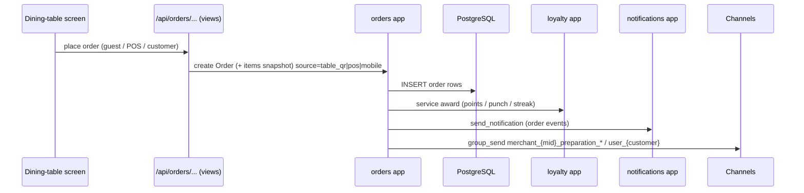
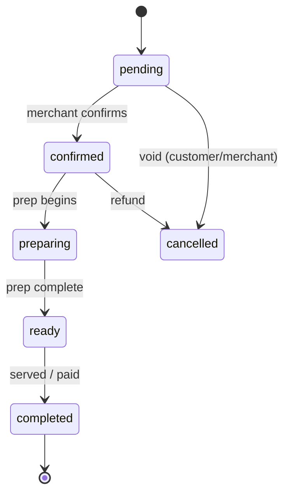

# Orders & Fulfillment — Zentro (domain: orders)

> Evidence: `orders/views.py` (`update_order_status`, guest create, `_award_loyalty`,
> punch-card redemption order), `loyalty/views.py` (reward redeem, punch confirm),
> `pos/views.py` (create_pos_order, split, refund), `merchants` MenuItem snapshots.
> Source of truth: `docs/architecture/database.md` + `backend.md`.

## Placement → award path (one arrow per verified call site)



## Status machine (verified against orders `OrderStatus`)



## Loyalty award coupling (the risky, destined-rework edge)

Loyalty awarding **lives inside order-confirm**, not in the loyalty engine:
`orders/views.py:_award_loyalty(profile, order, ...)` is called from `update_order_status`
(pending→confirmed), and `pos/views.py` re-imports `_award_loyalty` for the POS confirm
path. `loyalty/views.py` uses `Order(order_type=...)` for punch/reward redemptions.

```mermaid
flowchart TB
    CONFIRM[order confirm] --> AWARD[_award_loyalty<br/>orders/views]
    AWARD --> PTS[wallet points ledger]
    AWARD --> PUNCH[punch card add]
    AWARD --> STREAK[streak update]
    POS[POS payment confirm] -.reuses._award_loyalty.-> AWARD
    REDEEM[loyalty redeem confirm] --> ORD2[creates Order reward_redemption]
```

> Coupling flag: loyalty awarding + mission progress + punch are triggered from
> **orders** on confirm. Loyalty engine then *reads* those orders to build missions,
> punch cards, leaderboard, streak. This is a control-flow inversion — see `health.md`
> dependency risk #ORD-LOY.
