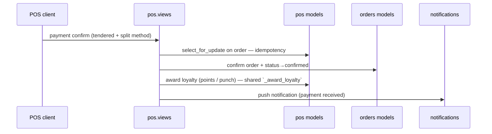

# Payments Domain — Zentro (domain: pos payments + order payments)

> Evidence: `backend/pos/views.py` (`create_payment`, `split_payment`, `refund`,
> `create_pos_payment`), `backend/orders/views.py` (`promote_to_guest`, payment callbacks),
> `src/features/pos/api/index.ts` (posPaymentApi), `src/routes/pos.tsx`,
> `src/routes/merchant.orders.tsx`, `src/features/transactions/pages/CartPage.tsx`.
> Money is **shift-scoped** (a POS cash/money ledger per open shift).

## Where money actually lives

| Term | Meaning (verified) |
|---|---|
| `PosPayment` | per-order tendered amounts (cash/card/split) on a device |
| `CashShift` | merchant cash drawer — opening/balancing per shift/worker |
| `PosDevice` | device identity + PIN gating for POS payments |
| `accounts.CustomerProfile.balance` / loyalty wallet | points ledger, not cash |
| order payment / refund | orders table `payment_total`, `refunded_amount` |

```mermaid
flowchart LR
    CHK[Checkout] --> PAY[PosPayment create (cash/card/split)]
    PAY --> CASH[(CashShift drawer)]
    PAY --> REST[(REST /api/pos/payment/ ...)]
    PAY --> REF[Refund flow]
    PAY --> FULFILL[fulfillment notification]
```

## Payment flow (order-scoped → merchant-scoped)



## Refunds

- Refunded against the order `payment_total`; capped at paid amount.
- Refunded amount **returns to the POS shift money ledger**, not to a processor.

## Integrations — none active

- **No external payment gateway** (no Stripe/eSewa/Khalti). Payments are fully internal
  POS record-keeping. See `integration.md`/`deployment.md` for the gap.
