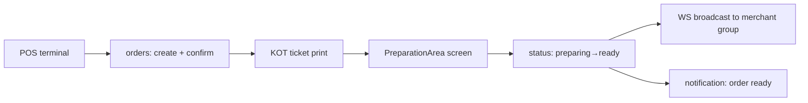

# POS + Kitchen Display System (KDS) — Zentro (domain: pos / preparation)

> Evidence: `backend/pos/*`, `backend/orders/preparation*`, `src/features/pos/*`
> (screens + api + store + offline), `src/features/preparation/*`,
> `src/routes/pos*.tsx`, `src/routes/merchant.preparation.tsx`,
> `src/features/pos/printing/*` (KOT ticket), `src/features/pos/offline/*`.

## Two operator surfaces, one realtime model

- **POS terminal** (merchant staff): `pos` start of shift → add items → split/combine →
  pay → shift close → Z-report. Device-auth via `Shifts` + `PinPad` + `ShiftWorker`.
- **KDS / preparation** (kitchen staff): `PreparationArea` groups, KOT tickets generated
  on order confirm, status transitions broadcast over `merchant_{mid}_preparation_*` group.

## POS order → preparation routing

Every `OrderItem` carries `prepare_area` (FK `preparation.PreparationArea`). On confirm,
`orders/service/preparation.py` routes items to their area and pushes a realtime
`preparation` event (group `merchant_{mid}_preparation_{area}`). KDS updates happen in
place without a page reload.

## Offline-first POS

`src/features/pos/offline/*`:

- `db.ts` — IndexedDB (`zentro-pos-db`, dexie) schema: `shifts`, `devices`, `workers`,
  `orders`, `payments`.
- `sync.ts` — queue-based push when back online (`syncQueue`, queue `zentro_offline_*`);
  retry with exponential backoff.
- `hooks.ts` — `useOfflineStatus`, `usePosOnline`, `useSyncProgress` etc.

> Offline is a POS-scoped persistence layer — not global. Merchant/analytics screens assume
> live connectivity unity today; only POS truly works offline. Noted in `health.md`.

## Cash / shift ledger

`pos` shift-scoped money (`CashShift`, `PosPayment`, `Refund`), PIN/device gating:
`ShiftWorker` links `User` ↔ `MerchantProfile` for the shift + POS device. Z-report reads
`PosPayment` per shift (see `payments.md`).
