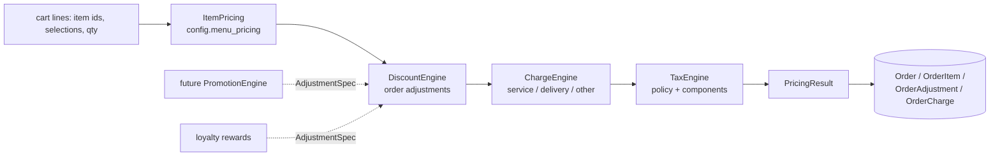

# Pricing — Zentro (domain: order money)

> Status: **implemented (pricing v1)**. Code: `backend/orders/pricing/`, frontend preview
> `src/lib/pricing/preview.ts`. Tests: `orders/test_pricing_engine.py`,
> `orders/test_pricing_flows.py`, `src/lib/pricing/preview.test.ts` (`npm run test:pricing`).

## 1. One authority for money

Every flow that creates or changes an order prices it with the same engine:

| Flow                                  | Entry point                                                          |
| ------------------------------------- | -------------------------------------------------------------------- |
| Customer app order                    | `orders/views.py::create_order`                                      |
| Guest / table-QR order                | `orders/views.py::guest_create_order`, `pos/views.py::table_order`   |
| Checkout preview                      | `orders/views.py::preview_order`                                     |
| POS order (online and synced offline) | `pos/views.py::create_pos_order`                                     |
| Add items to an open order            | `orders/views.py::add_items_to_order`                                |
| POS manual discount apply / remove    | `pos/views.py::apply_discount`, `remove_discount`                    |
| Offline conflict resolution           | `pos/views.py::resolve_conflict`                                     |
| Loyalty reward / punch-card orders    | `loyalty/views.py` (zero-price orders, same snapshot)                |
| AI Waiter                             | never prices totals; asks `config.menu_pricing` for line prices only |

Client-sent subtotals, discounts, tax and totals are ignored everywhere.

## 2. Modules (`backend/orders/pricing/`)

| Module         | Responsibility                                                                                                                                                                                                                    |
| -------------- | --------------------------------------------------------------------------------------------------------------------------------------------------------------------------------------------------------------------------------- |
| `items.py`     | Wraps the existing `config.menu_pricing.validate_and_price_line` (variants, modifiers, Today's Special, availability, cross-merchant checks). Existing order lines are re-priced from their **stored** price, never today's menu. |
| `discounts.py` | Evaluates stored adjustments (manual discount, loyalty/punch reward, promotion) against line net amounts; min-spend and eligible-line rules; largest-remainder allocation to lines.                                               |
| `charges.py`   | Service/delivery/packaging/other charges, percentage of the discounted goods value or fixed.                                                                                                                                      |
| `tax.py`       | Tax policies (code-defined) and the TaxEngine.                                                                                                                                                                                    |
| `service.py`   | `calculate(ctx)` (pure), context builders, persistence, `reprice_order`, `attach_adjustment`, `remove_adjustments`.                                                                                                               |
| `snapshot.py`  | Reads an order's stored breakdown for receipts, refunds, reports. Never recalculates.                                                                                                                                             |
| `split.py`     | Split-bill allocation rule (no split-bill feature exists yet; this is the rule it must use).                                                                                                                                      |
| `money.py`     | Decimal quantization per currency minor unit, ROUND_HALF_UP, largest-remainder allocation.                                                                                                                                        |

## 3. Rules

- **Decimal only.** Currency minor units come from ISO 4217 (JPY 0, KWD 3, default 2).
- **Today's Special is a selling price**, not a discount. The line stores `list_unit_price`
  (before the special) and `price` (effective). It never occupies the discount slot.
- **One discount/reward per order (V1 business rule).** Enforced in the service
  (`MAX_ORDER_ADJUSTMENTS = 1`) and in the database (partial unique constraint
  `one_active_order_adjustment_v1`). A cashier changing their own manual discount replaces
  it; anything else in the slot is refused with _"Remove the current reward before applying
  another offer."_ Stacking later = raise the constant and drop the constraint.
- **Discounts are stored as definitions**, not amounts, and re-evaluated on every order
  change. A percentage discount follows the basket; a minimum-spend rule that stops being
  met gives 0 and returns a structured message
  (`MINIMUM_ORDER_NOT_MET`, `required`, `current`, `shortfall`).
- **Line allocation.** Each order-level discount is split across eligible lines
  (`OrderAdjustmentAllocation`, `OrderItem.discount_amount`). Tax is allocated back to lines
  and charges the same way. Invariant, checked in `calculate`:
  `Σ line totals + Σ charges (+ their tax when exclusive) == grand total`.
- **Rounding.** Each tax component is computed on the invoice-level taxable base and
  rounded once (as Zentro always did), then allocated to lines by largest remainder.
- **Snapshots.** Each order stores `pricing_version`, `tax_policy_snapshot`,
  `tax_components_snapshot`, `prices_include_tax`, currency snapshots and per-line
  `discount_amount / taxable_amount / tax_amount / total_amount`. Open orders re-price with
  their own tax snapshot, so a merchant changing tax mid-service does not change open bills.
- **Locking.** `Order.save()` sets `pricing_locked_at` the moment an order is paid,
  completed, cancelled or refunded (migration `0026` locked existing settled orders). A
  locked order cannot be re-priced, discounted or have items added.
- **Refunds** use stored line values: `POST /api/pos/refund/` accepts
  `items: [{order_item_id, quantity}]`; the amount is the line's charged total (discount and
  tax included), the last unit takes the remainder. Pre-v1 orders refund by amount.
- **Reports** aggregate stored order fields (`subtotal`, `discount_amount`, `tax_amount`,
  `service_charge`, `total_amount`), which the engine keeps consistent.

## 4. Tax policies

Policies describe _behaviour_; rates come from the merchant's validated `tax_components`.
`MerchantProfile.tax_policy` is read-only to merchants (Django admin only), because the
calculation order is a legal question.

| Code               | Prices                  | Discount reduces taxable value            | Charges taxed | Typical use                        |
| ------------------ | ----------------------- | ----------------------------------------- | ------------- | ---------------------------------- |
| `legacy` (default) | tax added               | **no** — tax on the pre-discount subtotal | no            | exactly Zentro's pre-v1 behaviour  |
| `exclusive`        | tax added               | yes                                       | yes           | Nepal VAT, India GST, US sales tax |
| `inclusive`        | tax included, extracted | yes                                       | yes           | UK VAT, Australian GST             |

**Decision pending:** every merchant is on `legacy` so no existing total changed. Moving a
merchant (or all Nepal merchants) to `exclusive` is a one-field admin change once the
business confirms the rule with its accountant.

Item tax classes: `standard`, `exempt`, `zero_rated` (`MenuItem.tax_class`, snapshotted on
`OrderItem.tax_class`).

## 5. Frontend preview

`src/lib/pricing/preview.ts` is a line-for-line port of the engine using BigInt minor
units. The POS uses it through `usePosCartPricing()` (cart panel, payment sheet, mobile
cart button). It runs the same golden vectors as the backend
(`backend/orders/pricing/vectors.json`), so preview and server cannot drift silently.
The POS charges the **server** total: the payment sheet creates the order, applies the
cart's pending discount on the server, then pays the total the server returns.

## 6. API additions

- `GET /api/orders/<id>/pricing/` — stored breakdown (lines, discounts, allocations,
  charges, taxes, messages). Owner customer/merchant only.
- `POST /api/pos/discount/remove/` — remove the order's manual discount.
- `POST /api/orders/preview/` now returns `discount_amount`, `taxable_amount`, `charges`,
  `prices_include_tax` and a full `pricing` block; accepts `fulfillment_type`.
- Order serializers expose the snapshot scalars; order items expose per-line money.
- `tax_breakdown` amounts on v1 orders are exact decimal strings (older orders keep floats).

## 7. Audit findings fixed by this work

1. The "total" formula (subtotal − discount + tax + service) was re-implemented in six
   places; now one engine.
2. POS manual discounts were stored as a fixed amount and never recalculated when items
   were added; now re-evaluated on every change.
3. `Order.currency_code_snapshot`, `tax_type_snapshot`, `tax_rate_snapshot` existed but
   were never populated.
4. `pos/views.py::table_order` saved the order before validating lines, leaving a partial
   order behind when a line was rejected (atomic view returned a Response instead of
   raising). It now prices everything first.
5. The POS "Apply Discount" button could never work: the modal sent an empty order id.
   The discount now sits on the cart and is applied server-side after order creation.
6. The POS preview ignored the legacy tax-rate fallback (default 6%) and rounded with
   floats; it now matches the server exactly.
7. Merchant `tax_components` were saved without validation.
8. `service_charge` was a field nobody computed; it is now a structured, configurable
   charge (merchant setting, dine-in only by default, 0 = off).

## 8. Known limitations

- Split bill is not a product feature yet; `split.py` defines and tests its allocation.
- Loyalty and punch-card rewards are still separate zero-total reward orders (unchanged
  product behaviour). The DiscountEngine supports them as order adjustments when the
  product wants rewards applied to a real order.
- Refunds remain one per order (existing rule); line refunds choose what that refund covers.
- Delivery/packaging charges are supported by the engine but no merchant setting creates
  them yet.
- Offline POS cannot apply discounts (they are only ever applied by the server).
- Two table-QR order endpoints still exist (`/api/orders/guest-create/`,
  `/api/pos/table/<token>/order/`); both use the engine, merging them is a separate cleanup.
- DB money columns have 2 decimal places, so 3-decimal currencies would round at storage.
