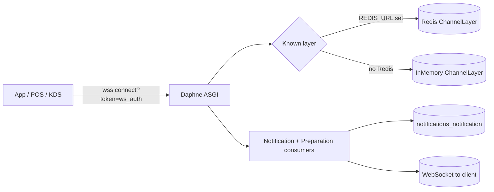

# Realtime & Notifications — Zentro (domain: realtime)

> Evidence: `backend/config/asgi.py`, `backend/notifications/*` (consumers/services/models,
> ws token, web push), `backend/notifications/consumers.py` (`PreparationConsumer`,
> `NotificationConsumer`), `backend/orders/services/preparation.py` (`broadcast_area_event`),
> `backend/notifications/routing.py`, `src/lib/ws.ts`, `src/lib/api/ws.ts`,
> `src/features/notifications/api.ts`.

## The world in three arrows



## WS auth (why it's a 60s token)

- `injectApiBase` (frontend) reads `DJANGO_API_BASE_URL`.
- `ws.ts` — `getWsToken()` calls `GET /api/auth/ws-token/` → a **60-second** `ws_auth` JWT.
- On the backend, `JWTAuthMiddleware` (`notifications/middleware.py`) only accepts WS tokens
  carrying the `ws_auth` claim — a normal access JWT is rejected (prevents token leakage
  into channel history / logs / proxies).
- `NOTIFICATIONS_WS_EXPIRY`/`ws_auth` — verify exact var name in health.md.

## Consumer dispatch

```mermaid
flowchart TD
    ROUTE[URLRouter] --> N[NotificationConsumer]
    ROUTE --> P[PreparationConsumer]
    N --> NG[group user_{uid}]
    P --> PG1[merchant_{mid}_preparation_{area}]
    P --> PG2[merchant_{mid}_preparation_all]
    NG --> NU["push .notification.message"]
    PG1 --> PU["pushes area updates + KDS lane"]
```

## Push + in-app fan-out (single origin `notifications/services.py`)

```
database + WS + web push all originate from ONE call site: notifications/services.send_notification(user, payload)
  → persist Notification row (badge + list + in-app center)
  → group_send("user_{id}", {"type":"notification.message", ...})   [realtime]
  → web_push(user, payload)                                          [PWA/VAPID, best-effort]
```

- Web push uses `pywebpush` + VAPID; `PUSH_SUBSCRIPTIONS` are stored per user endpoint;
  401/410 → subscription deleted; failures are swallowed (no crash, no retry storm).
- **Realtime fan-out lives in orders/preparation too** — preparation events are broadcast
  directly from `orders/services/preparation.py` via Channel layer groups, not re-routed
  through notifications.

## Realtime channels used today (verified group/consumer table)

| Channel layer group | Consumer | Source of data | Frontend consumer |
|---|---|---|---|
| `user_{user_id}` | `NotificationConsumer` | `Notification` rows + web push | `src/lib/ws.ts` + `useUnreadCount` |
| `merchant_{merchant_id}_preparation_{preparation_area_id}` | `PreparationConsumer` | `OrderItem` (KDS lane) | `PreparationAreaFilter` map |
| `merchant_{merchant_id}_preparation_all` | `PreparationConsumer` | `OrderItem` (all areas) | KDS "all" view |
| `ws/notifications/` | — (HTTP→WS bootstrap) | — | `useNotificationsWs` |
| `ws/preparation/merchant/{mid}/area/{area}` | — | — | KDS consumer |

## Realtime health flags (see health.md for full list)

- `pos` parses/prints KOT + shift data entirely from **REST + local state**, and only uses WS for
  incoming-order notification — no tight binding.
- Index/Home realtime is implemented via **polling + Background Sync** (offline-first), not WS.
- Zentro emits WS for notifications + preparation only, not for generic chat. AI waiter chat
  uses HTTP streaming (see `ai.md`).
