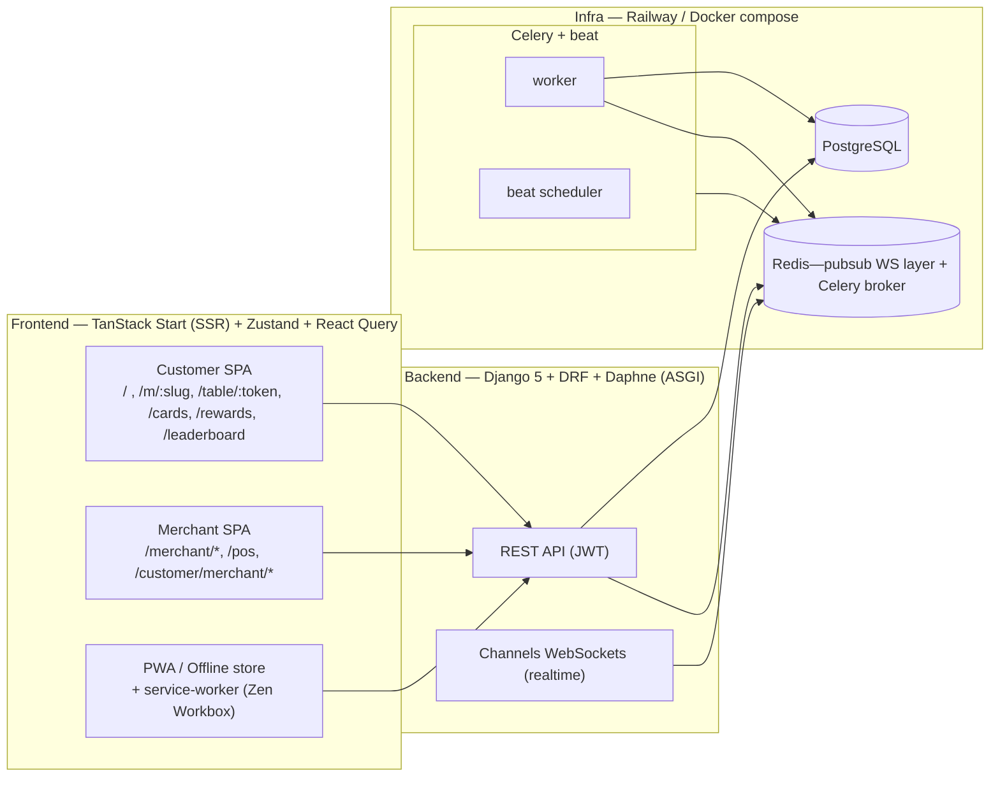
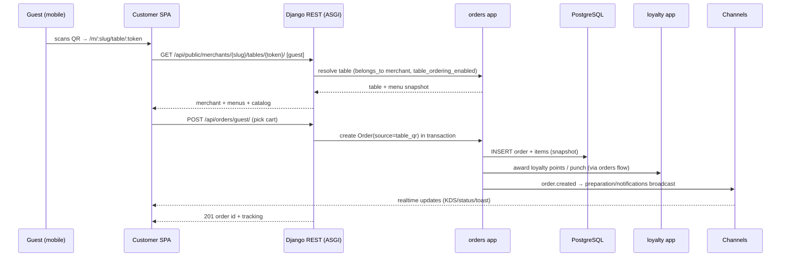

# System Overview — Zentro

> Evidence-based view of the whole Zentro_globe platform: two runtimes (TanStack React SPA +
> Django/DRF) coordinated over a single PostgreSQL + Redis + Channels realtime layer. Read
> with the domain map in `database.md` and the app graphs in `backend.md` / `frontend.md`.

---

## Big Picture — pillars



## Stack details

| Concern | Choice |
|---|---|
| Frontend | TanStack Start (SSR) + React 19, Tailwind v4, shadcn/ui, TanStack Router + Query |
| Auth | Django JWT (SimpleJWT) via Django API — **Supabase removed** (migration doc in README) |
| Realtime | Django Channels (Daphne/ASGI), RedisChannelLayer, JWTAuth WS middleware |
| Background | Celery + Redis broker; bonus: Celery beat — see `background.md` |
| Realtime data bus | Orders/PreP (KDS) + notifications, see `realtime.md` |
| AI | `ai_core` app: rule + LLM hybrid for merchant assistant + AI waiter (see `ai.md`) |
| Storage | Local filesystem / S3 via Django Storage + media-upload view |

## End-to-end: a guest QR order (zoom of the pillars)



## How the monorepo is organised

```mermaid
graph LR
    ROOT[Zentro_globe]
    ROOT --> SRC[src/ — React+TS frontend]
    ROOT --> BACK[backend/ — Django]
    ROOT --> DOCS[docs/ — knowledge base + verification]
    ROOT --> SCRIPTS[scripts/ — backup/restore/build assistance]
    ROOT --> SUPABASE[supabase/ — migration assets (legacy)]
    SRC --> FEATURES[features/* — 20 feature dirs]
    SRR --- ROUTES[routes/* — TanStack file routes]
    BACK --> APPS[accounts, merchants, orders, pos, loyalty, notifications, ai_core]
    BACK --> CONFIG[config/ — settings, asgi, celery]
```
