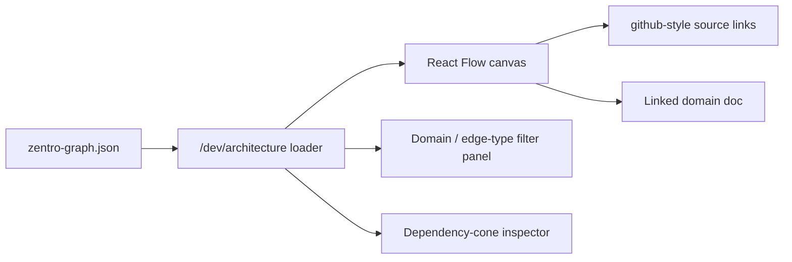

# Interactive Architecture Viewer — Proposal (Zentro)

> Target UX: a `/dev/architecture` page (frontend route, **dev-only**, gated to
> authenticated superuser) that renders `docs/architecture/graph/zentro-graph.json`
> with **React Flow**. This is a **proposal** — nothing is implemented or installed yet.

## Why React Flow (vs. one big hand-drawn SVG)

The graph JSON is the single source of truth. Hand-drawn SVG files rot within weeks. React
Flow lets us:

- render `nodes` + `edges` straight from JSON (optional, no `unstable` API use)
- zoom/pan/filter by domain, edge type, app — no giant diagram problem (every prior doc
  follows "multiple focused Mermaid graphs")
- click a node → jump to its `filePath` + its owning doc (`frontend.md`, `backend.md`, …)
- highlight a node's full dependency cone (immediate in/out edges)

## Layout strategy (avoid the "hairball")

1. **Layout by domain layer** (X axis: domain index; Y: tier — routes / features / api /
   backend apps / models). Static layout, no force-simulation needed for phase 1.
2. **Collapse to features** by default; drill into a feature to see its module nodes.
3. **Edge-type color-coding**: `uses` grey, `couples` amber, `realtime` teal, `background`
   blue, `fk` dashed. Matches the type legend in `health.md` and the `.md` mermaid graphs.
4. Optionally overlay **graphify** output later (import a Graphify-Labs generated graph as a
   separate layer) — see `visualization.md`.

## Route + gating proposal

| Concern | Proposal |
|---|---|
| Route | `src/routes/dev/architecture.tsx` (dev-only) |
| Gate | server `loader` checks `is_staff`; 404 for normal users; strip from prod build via `import.meta.env.DEV` guard |
| Data | load `zentro-graph.json` via Vite `?url` import (bundled as static asset) |
| Gating even harder | hide unless `VITE_FEATURE_DEV_ARCHITECTURE=true` |

> Acceptance: opening `/dev/architecture` shows the full typed graph, filtering by
> `realtime` shows only the 5 WS channel/broadcast edges, clicking `orders` shows its cone
> (orders→pos, orders→loyalty, orders→notifications).

## What we are NOT doing in the viewer

- No editing of the graph from the UI (facts come from the scanner, not from drag-drop).
- No auto-layout physics that reshuffles the canvas on every reload (deterministic layout).
- No huge single-canvas "everything at once" default.
