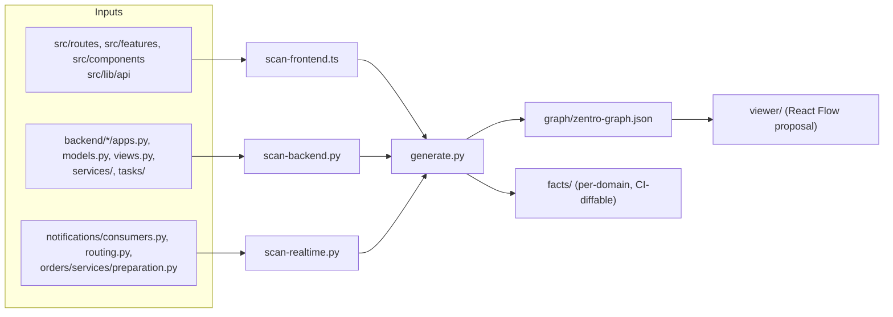

# Architecture Scanner / Automation Scripts — Zentro

> READ-ONLY, **no-install** design: these scripts turn the codebase into `zentro-graph.json`
> + per-domain facts. They are **proposals** — the `.md` docs were written from human
> verification; the scanner is the *someday* auto-regenerator so facts never rot.
>
> Nothing here is required to understand the architecture. Nothing here installs packages.

## Directory

```
scripts/architecture/
├── README.md          ← you are here
├── scan-frontend.ts   ← TS scanner: src/routes + src/features + src/components + imports
├── scan-backend.py    ← Python scanner: apps, models, FKs, views→services→ORM, celery tasks
├── scan-realtime.py   ← Python scanner: Channels consumers + ws token + channel groups
└── generate.py        ← merges the three into graph/zentro-graph.json + facts/*.json
```

## Contract with the docs

- The scanner emits the JSON that `docs/architecture/graph/zentro-graph.json` is defined to
  hold. It never writes `*.md` — the markdown is human-maintained (intent).
- Scanner output shapes: `nodes: [{id, type, label, app/feature, filePath}]` and
  `edges: [{source, target, type, evidences:[filePath]}]` with the same
  `type ∈ [uses, couples, realtime, background, fk, depends]` as the docs' health table.
- **dry-run by default** (`--dry-run` prints to stdout, does not write); `--write` persists.
- Deterministic ordering & stable ids (`app:orders`, `feature:pos`, `model:Order`) so diffs
  in CI are meaningful.

## Conceptual pipeline



## What each scanner pulls

### scan-frontend.ts
- Route files under `src/routes/` → node `route:<file>`; group by feature dir under
  `src/features/` → node `feature:<name>`.
- Static imports (`import ... from "@/features/..."`) → edge `uses`.
- API clients under `src/lib/api` + `src/lib/ws.ts` → edges to backend method names.

### scan-backend.py
- `backend/*/apps.py` name + Django apps.py → `app:<name>`.
- `models.py` class bases + `models.ForeignKey/OneToOne/M2M` → `model:<Name>`,
  edge `fk` model→model.
- URL include tables (`config/urls.py`) → edge app↔app.
- `views.py` → `views.py` / `viewsets` → app; call sites that cross imports
  (e.g. `import loyalty` from `orders/views.py`) → edge `couples`.

### scan-realtime.py
- `consumers.py` classes × `routing.py` path regex → `group:<group>` nodes.
- `group_send(group, ...)` in services → edges `realtime` service→group→consumer.
- Celery `@app.task`/`@shared_task` + `config/celery.py` beat schedule → node
  `task:<name>` + `background` edges.

## Running safely (read-only compliance)

1. `node --experimental-strip-types scripts/architecture/scan-frontend.ts --dry-run`
2. `python scripts/architecture/scan-backend.py --dry-run`
3. `python scripts/architecture/scan-realtime.py --dry-run`
4. `python scripts/architecture/generate.py --dry-run`

All four default to stdout-only. No files touched, no packages installed, no app code read
for side effects (pure AST walk via `os.walk` + regex/`ast`).
